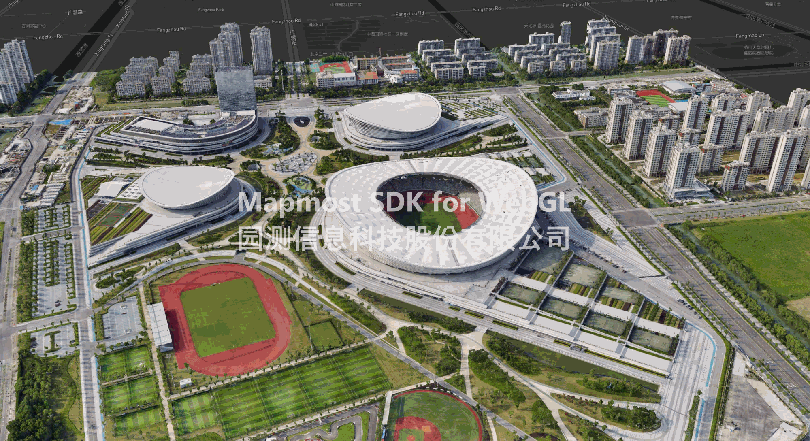
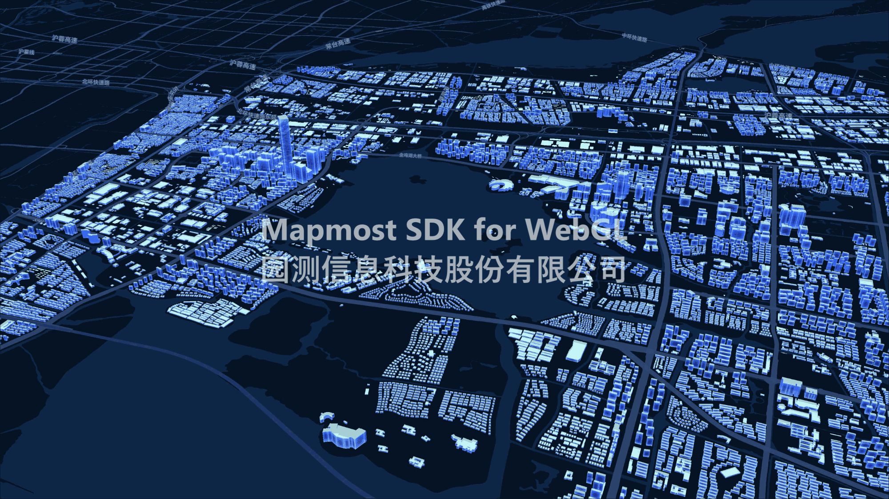
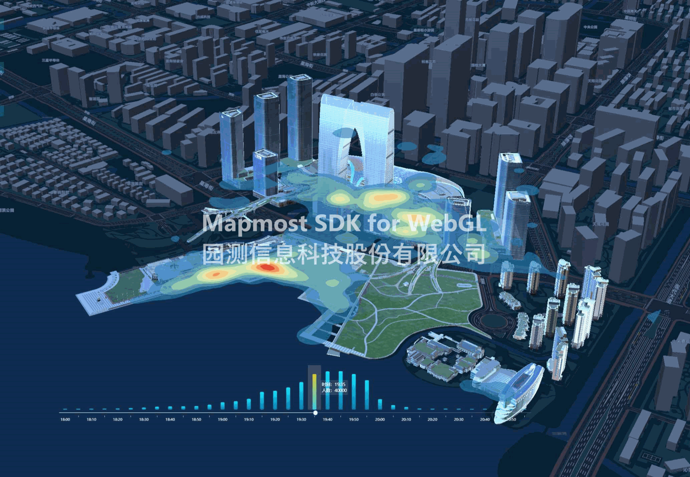
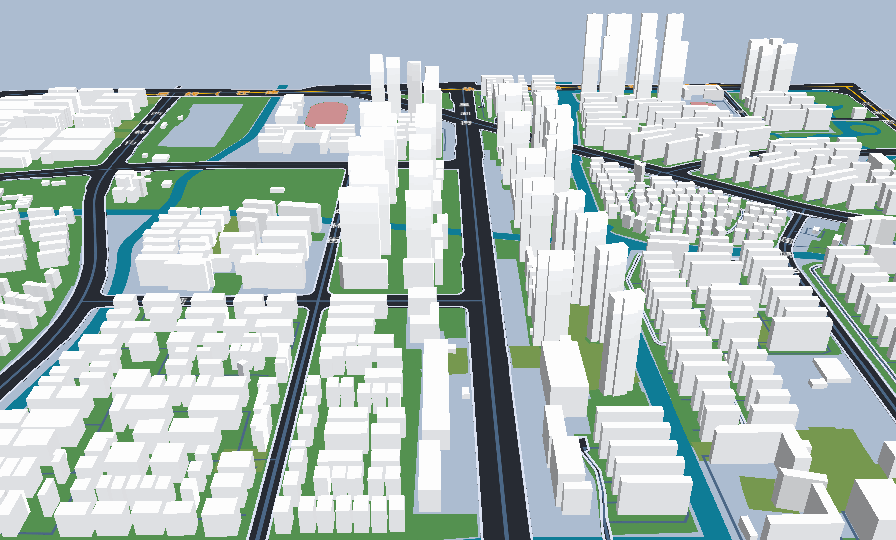
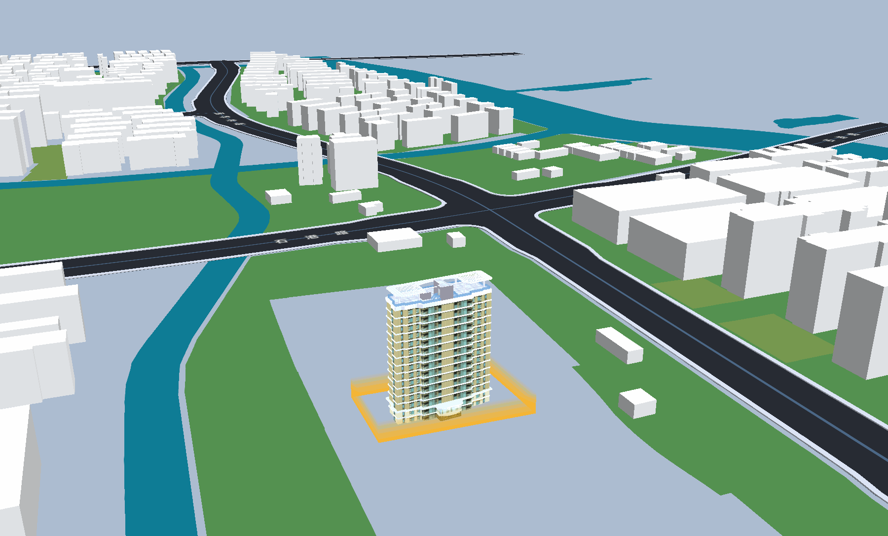

# 简介
本项目包含了各种基于 Mapmost SDK for WebGL 实现的示例，旨在帮助大家了解该SDK的核心用法。

## Mapmost SDK for WebGL

  Mapmost SDK for WebGL是 [Mapmost 系列](https://www.mapmost.com/) 的重要部分，是基于 WebGL 实现二三维地图一体化渲染的 JavaScript 库。
  
  - 该引擎作为 Mapmost 生态系统的一部分，主要面向Web端三维地图应用程序和时空数据可视化应用开发，作为基础地图引擎使用，可加载矢量瓦片地图服务、倾斜三维模型、gltf/glb格式三维模型、obj格式三维模型，以及WMS、TMS、WMTS地图服务。

  - 开始使用 Mapmost SDK for WebGL，请注册 [Mapmost 账户](https://www.mapmost.com/#/productApply/webgl)。

  

- - -

## 支持的核心能力

- 地图图层可视化二次开发
- 三维对象/场景二次开发
- 数据驱动的三维专题分析地图二次开发
- 三维模型/场景与2.5D地图的融合渲染
- 视频与三维地图融合
- 倾斜数据加载渲染
- 千万级三维构件高性能加载与单体点选
- CGCS 2000支持
- 支持多种坐标系栅格服务接入

|多源时空数据支持|三维场景视觉特效|三维地理分析计算
|---------|-----------------------|-----------------------
|||

- 更多能力说明请参考 [文档](https://www.mapmost.com/mapmost_docs/webgl/latest/docs/intro/)。

- - -

## 示例

- 示例正在持续更新中，想要了解更多请参考 [示例预览](https://www.mapmost.com/mapmost_docs/webgl/latest/docs/card-default)。

|建筑信息查询|建筑分层分户|车辆轨迹展示
|---------|-----------------------|-----------------------
|||

|矢量可视域分析|手工模型可视域分析|倾斜模型可视域分析
|---------|-----------------------|-----------------------
|||

